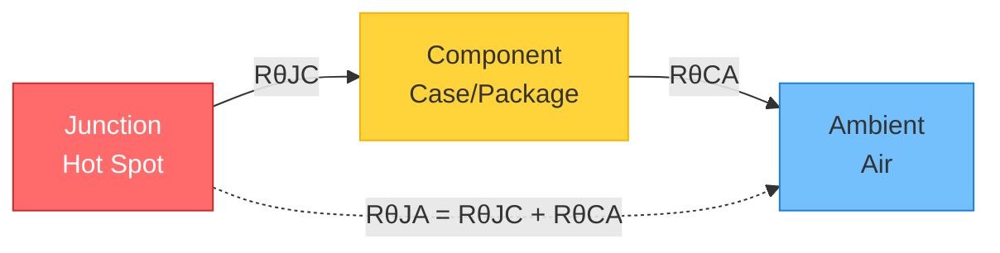

## 🧩 **Design for Reliability & Compliance (DfR + Regulatory Standards)**

---

### **Thermal Management and Derating**

**Objective:**
Ensure that electronic components operate below their maximum rated temperature to prevent premature failure and improve system reliability.

---

#### 🔹 **Understanding Power Dissipation and Thermal Resistance**

**Key Concepts:**

* **Power dissipation (Pd):** $P_d = V_{drop} \times I$ or $P_d = I^2 \times R$
* **Thermal path:** Junction → Case → Ambient (RθJC, RθCA, RθJA).
* **Junction temperature (Tj):**
  
  $$T_j = T_a + (P_d \times R_{\theta JA})$$

---

**Understanding Thermal Resistance Parameters:**

These thermal resistance parameters describe how heat flows from the chip to the environment:

* **RθJC (Junction-to-Case):** Thermal resistance from semiconductor junction to component case/package
  - Intrinsic to component design
  - Unit: °C/W
  
* **RθCA (Case-to-Ambient):** Thermal resistance from component case to surrounding air
  - Depends on heatsinks, airflow, PCB copper, thermal vias
  - Unit: °C/W
  
* **RθJA (Junction-to-Ambient):** Total thermal resistance from junction to ambient
  - **RθJA = RθJC + RθCA** (thermal resistances add in series)
  - Most commonly used for quick calculations
  - Unit: °C/W

---

---

**Thermal Calculation Example:**
If a chip dissipates 2 W with RθJA = 50 °C/W at 25 °C ambient:
- Temperature rise = $2~\text{W} \times 50~\text{°C/W} = 100~\text{°C}$
- Junction temperature = $25~\text{°C} + 100~\text{°C} = 125~\text{°C}$

> 💡 **Key Insight:** Lower thermal resistance = better heat dissipation. Improving RθCA (via heatsinks, copper pours, thermal vias) reduces overall RθJA.

---

**Practical Example:**
A linear regulator (5 V → 3.3 V @ 0.5 A) dissipates $(5 - 3.3) \times 0.5 = 0.85~\text{W}$.
On a PCB with **RθJA = 50 °C/W**, the junction temperature rise is **42.5 °C** above ambient.
At 40 °C ambient, **Tj ≈ 82.5 °C**, which is safe but close to limits — adding a small copper pad or thermal vias could reduce this by 10–15 °C.

---

#### 🔹 **Component Derating Rules**

**Key Practices:**

* **Capacitors:** Use ≤ 80 % of voltage rating (e.g., 25 V cap on 20 V rail = poor choice).
* **Resistors:** Use ≤ 60 % of power rating.
* **Semiconductors:** Keep junctions ≤ 80 % of rated temperature.
* **Inductors:** Avoid core saturation; use 70–80 % of Isat.

**Practical Example:**
In automotive circuits (14 V nominal, 40 V surge), 50 V ceramic capacitors are standard — even though 25 V could suffice electrically, derating ensures reliability over time and temperature.

---

#### 🔹 **PCB-Level Thermal Management**

**Techniques:**

* Use **wide copper pours** for heat spreading.
* Add **thermal vias** under power components.
* Consider **multi-layer boards** for better conduction.
* Simulate using Altium, Ansys Icepak, or PDN Analyzer.

**Example:**
A TO-263 MOSFET running at 2 A reduced junction temperature from **105 °C → 78 °C** after adding 12 thermal vias under its pad to the inner ground plane.

---

#### 🔹 **System-Level Cooling Design**

**Methods:**

* Natural convection vs. forced airflow.
* Heatsinks, thermal interface materials, and case ventilation.
* Temperature sensors for thermal feedback.

**Example:**
LED driver enclosure overheated (95 °C LED board). After redesign with vent holes and aluminum heatsink plate, LED board stayed below **70 °C**, extending lifetime from ~10,000 h to > 30,000 h.

---

### **EMC/EMI Design and Testing**

**Objective:**
Minimize electromagnetic emissions and susceptibility to interference to meet global standards like **CE**, **FCC Part 15**, and **CISPR 32**.

---

#### 🔹 **Fundamentals of EMC**

**Key Concepts:**

* **Emission:** What your circuit radiates or conducts out.
* **Immunity:** How resistant your circuit is to external noise.
* **Test categories:**

  * Conducted emissions (150 kHz–30 MHz)
  * Radiated emissions (30 MHz–1 GHz)
  * ESD, surge, EFT for immunity.

**Example:**
Switch-mode power supplies are frequent EMC offenders — their high-frequency switching creates harmonics that radiate from cables and traces.

---

#### 🔹 **PCB Layout for EMI Control**

**Techniques:**

* Use **continuous ground planes** — avoid gaps under signal lines.
* Keep **loop areas small** for high-speed or high-current traces.
* **Place decoupling capacitors** close to IC power pins.
* **Use differential pair routing** for high-speed signals.

**Example:**
An MCU with 20 MHz crystal caused radiated emission peaks. By moving the crystal closer and reducing trace length to capacitors (< 10 mm), emissions dropped by **6 dB**, passing Class B limits.

---

#### 🔹 **Filtering and Shielding**

**Methods:**

* **Ferrite beads** on power lines.
* **Common-mode chokes** on differential lines (e.g., USB, Ethernet).
* **LC or π filters** for DC inputs.
* **Shielded enclosures or cable braiding.**

**Example:**
A USB product failed CE due to radiated noise. Added 120 Ω common-mode choke → noise reduced below 40 dBµV/m.

---

#### 🔹 **Grounding and Segmentation**

**Principles:**

* Separate **analog**, **digital**, and **power grounds** when necessary.
* Connect at a **single star point** or via a ferrite bead.
* Avoid split planes under high-speed traces.

**Example:**
Mixed-signal ADC PCB with poor ground separation showed 8-bit noise. After adding a single-point AGND–DGND connection and better return path, noise reduced to < 1 LSB.

---

#### 🔹 **Pre-Compliance & Final Testing**

**Steps:**

* Use **near-field probes** and **EMC scanners** to find hotspots.
* Conduct **pre-scan** at in-house lab before official test.
* Retest after layout or filter changes.

**Example:**
IoT device failed conducted emission due to 500 kHz switching regulator. Adding snubber + ferrite + π filter dropped emission by 12 dB, passing CISPR 32 limits.

---

### **Safety and Isolation Design**

**Objective:**
Protect users and systems from electric shock, fire, and overvoltage conditions per **IEC 62368**, **UL**, and **CSA** standards.

#### 🔹 Creepage & Clearance

* Define spacing requirements between conductive parts.
* Follow standards:

  * 250 V AC → 4 mm creepage minimum (basic insulation).
  * Reinforced insulation often doubles that.

**Example:**
SMPS transformer: increased PCB spacing from 2.5 mm to 4.2 mm and added slot cutouts to meet 3 kV isolation.

---

#### 🔹 Isolation Components

* Optocouplers, digital isolators, transformers.
* Verify isolation ratings (2.5–5 kVrms typical).
* Use reinforced insulation materials for safety-critical designs.

**Example:**
In medical ECG front-end, used ADuM141E digital isolator (5 kVrms) to separate patient-side circuits from system MCU.

---

#### 🔹 Surge and Overvoltage Protection

* MOVs, TVS diodes, gas discharge tubes.
* ESD protection diodes on data and I/O ports.
* Proper grounding and transient path management.

**Example:**
Power input of industrial controller uses MOV + GDT combo to handle 2 kV surge per IEC 61000-4-5.

---

#### 🔹 Fusing and Current Limiting

* Use resettable or fast-blow fuses.
* Integrate current-sense resistors or protection ICs.
* Example: USB input protected with 500 mA polyfuse to meet UL 60950-1.

---

### **Environmental & Mechanical Reliability**

**Objective:**
Ensure product durability under thermal, mechanical, and environmental stress.

#### 🔹 Temperature & Humidity Testing

* Burn-in and thermal cycling (−40 °C ↔ 85 °C).
* 85/85 test (85 °C, 85 % RH, 1000 h).

**Example:**
Sensor module failed after humidity exposure — conformal coating fixed corrosion and passed 85/85 test.

---

#### 🔹 Vibration and Shock Resistance

* Reinforce heavy components (glue or brackets).
* Choose flexible PCB materials for automotive or aerospace.

**Example:**
Automotive ECU potting reduced vibration-induced solder cracks by 90 %.

---

### **Regulatory Compliance & Certification**

**Objective:**
Meet global market entry requirements and maintain traceable compliance documentation.

#### 🔹 Understanding Standards

* **CE:** EMC + Low Voltage + RoHS.
* **FCC Part 15:** Emission limits for digital devices.
* **UL / IEC:** Product safety.
* **CSA / VDE:** Regional certification.

**Example:**
Consumer smart plug required CE, FCC, and UL — compliance testing planned early saved 3 months of redesign time.

---

#### 🔹 Documentation and Technical Files

* BOM, schematics, layout, and risk assessment reports.
* Maintain **Technical Construction File (TCF)** for CE marking.

---

#### 🔹 Testing & Certification Workflow

1. Pre-compliance testing.
2. Accredited lab testing.
3. Corrective actions and documentation.
4. Declaration of Conformity (DoC) and labeling.

**Example:**
IoT gateway failed radiated emissions; after shielding, passed FCC Class B and CE EMC Directive with no further modification.

---
